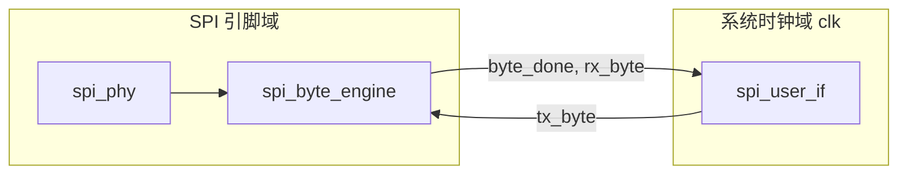

# SPI Slave IP

本文档描述本项目中 **FPGA SPI Slave** 的定位、架构与 Phase 1 实现规格。SPI 通用概念见 [SPI.md](../SPI.md)。

---

## 1. 角色与目标

在本项目里，FPGA 作为 **Slave**，MCU 作为 **Master**：

```
MCU (Master)  ──SPI──→  FPGA (Slave)  ──→  内部逻辑 / FIFO / 测试数据源
              ←─SPI───
```

| 阶段 | Slave 要做什么 |
|------|----------------|
| Phase 1 | 正确收发字节；Mode 0；仿真 + 上板与 MCU 互通 |
| Phase 2 | 支持 CS 保持下的连续多字节（burst）；对接内部数据源 |
| 后续 | RX/TX FIFO、更高 SCLK、帧协议；为高速 SPI 留扩展点 |

Phase 1 的成功标准：**MCU 发任意字节序列，FPGA 能稳定接收；FPGA 回传的数据与预期一致（如 echo）**。

---

## 2. 架构

Slave 按三层拆分，避免把「移位时序」和「数据链路」写在一起：

```
spi_slave_top                 顶层：引脚 + 参数 + 子模块例化
├── spi_phy                   PHY：SCLK/CS/MOSI/MISO 时序
├── spi_byte_engine           字节引擎：移位、bit 计数、byte_done
└── spi_user_if               用户接口：字节级 valid/ready（Phase 1）
                                日后替换为 FIFO / 寄存器文件
```



**时钟域说明：**

- 移位与 MISO 输出跟随 **SCLK**（或经同步后的 SCLK 域）。
- `rx_valid`、`tx_data` 等用户信号在 **系统时钟 `clk`** 域。
- `byte_done` 从 SCLK 域跨到 `clk` 域（单 bit 脉冲，双 flop 同步）。

---

## 3. Phase 1 规格

### 3.1 固定与可参数

| 项目 | Phase 1 | 参数名（预留） |
|------|---------|----------------|
| SPI Mode | **Mode 0**（CPOL=0, CPHA=0） | `CPOL`, `CPHA` |
| 数据位宽 | 8 bit | `DATA_WIDTH` |
| 位序 | MSB first | `LSB_FIRST` |
| CS | 低有效；CS↑ 结束当前字节序列中未完成的 bit 丢弃/复位 | — |
| 多字节 | **CS 保持低**：连续传多个字节，字节间无需 toggle CS | — |

### 3.2 Mode 0 时序（Phase 1 必须满足）

- **CPOL=0**：空闲时 SCLK 为低。
- **CPHA=0**：CS 有效后，第一个 SCLK **上升沿**采样 MOSI；MISO 在上升沿前稳定（下降沿更新常见实现）。

```
CS_N  ‾‾‾\__________________________/‾‾‾
SCLK  ‾‾‾\_/‾\_/‾\_/‾\_/‾\_/‾\_/‾\_/‾‾‾
MOSI  ----< B7 >< B6 >< B5 >...< B0 >----
MISO  ----< B7 >< B6 >< B5 >...< B0 >----
      ↑ CS↓                              ↑ CS↑
      首字节 MSB 先传                    帧结束
```

### 3.3 行为摘要

1. **CS_N 下降沿**：移位逻辑复位，准备接收/发送新字节。
2. **每个 SCLK 有效边沿**：MOSI → 移位寄存器；MISO 输出当前 tx 移位寄存器 MSB（或 LSB，由参数定）。
3. **8 个 SCLK 后**：产生 `byte_done`；锁存 RX 字节到用户接口；加载下一个 TX 字节（若 `tx_valid`）。
4. **CS_N 上升沿**：结束本帧；未完成 8 bit 的传输丢弃。

---

## 4. 模块接口

### 4.1 顶层 `spi_slave_top`

```verilog
module spi_slave #(
    parameter CPOL       = 1'b0,
    parameter CPHA       = 1'b0,
    parameter DATA_WIDTH = 8
) (
    // 系统域
    input  wire                     clk,
    input  wire                     rst_n,

    // SPI 引脚（直连 MCU）
    input  wire                     sclk,
    input  wire                     cs_n,
    input  wire                     mosi,
    output wire                     miso,

    // 用户域：接收（MCU → FPGA）
    output reg                      rx_valid,
    output reg  [DATA_WIDTH-1:0]    rx_data,

    // 用户域：发送（FPGA → MCU）
    input  wire                     tx_ready,
    input  wire [DATA_WIDTH-1:0]    tx_data,
    output reg                      tx_valid
);
```

### 4.2 握手语义

`rx_*` / `tx_*` 是 **面向 FPGA 系统内部** 的接口，不是板级引脚。Slave 与 Master 各自有一套同构的用户口；与 Gestalt SPI IP 库中其他模块（FIFO、寄存器、数据源）对接，而不是直接连到 MCU。

| 信号 | 方向 | 说明 |
|------|------|------|
| `rx_valid` | 出 | 每完成一字节置 1 一个 `clk` 周期；`rx_data` 有效 |
| `tx_valid` | 出 | 向内部逻辑请求下一发送字节；Slave 准备好发下一字节时置 1 |
| `tx_ready` | 入 | 内部逻辑有数据可发时置 1；与 `tx_valid` 同周期采样 `tx_data` |

完整 SPI IP 库的边界划分：

```
外部世界                    FPGA 芯片内部
─────────                  ──────────────────────────────────
MCU / 外设  ←SPI 引脚→  [ spi_slave | spi_master ]  ←用户口→  FIFO / 逻辑
```

Phase 1 可先做 **echo**：内部 `tx_data = rx_data`，`tx_ready = 1`，用于最快打通链路。

### 4.3 `spi_phy`（示意职责）

- 对 `sclk`、`cs_n` 做输入同步（防 metastability）。
- 根据 `CPOL/CPHA` 产生 **sample_en**、**shift_en**（Phase 1 仅 Mode 0 真值表）。
- 驱动 `miso` 输出（三态一般不需要，FPGA 推挽即可；多 Slave 总线时再考虑）。

### 4.4 `spi_byte_engine`

- 输入：`sample_en`、`shift_en`、`mosi`、`tx_bit`。
- 输出：`rx_byte`、`byte_done`、`miso`（或 `tx_bit` 链）。
- 内部：RX/TX 移位寄存器 + bit 计数器（0…7）。

---

## 5. 目录与工程

与 Gowin 工程 `SPI_Slave.gprj` 对齐，建议布局：

```
SPI_Slave/
├── SPI_Slave.md          ← 本文档
├── SPI_Slave.gprj
├── src/
│   ├── spi_slave_top.v
│   ├── spi_phy.v
│   ├── spi_byte_engine.v
│   └── spi_user_if.v     ← Phase 1 可与 top 合并
└── tb/
    └── tb_spi_slave.v    ← Master BFM + 自检
```

当前 `gprj` 指向 `src/SPI_Slave.v`；实现时可改为上述多文件或先用单文件 `SPI_Slave.v` 再拆分。

---

## 6. 验证计划

### 6.1 仿真

| 用例 | 内容 | 通过条件 |
|------|------|----------|
| T1 | 单字节 `0x55` | `rx_data==0x55`；MISO echo 一致 |
| T2 | 单字节 `0xAA` | 同上 |
| T3 | CS 保持，连续 4 字节 | 顺序、数值全对 |
| T4 | CS 中途拉高（半字节） | 无错误 `rx_valid`；下次 CS↓ 重新同步 |
| T5 | 背靠背多帧 | CS toggle 间无丢字节 |

Testbench 内建 **SPI Master BFM**：产生 SCLK、驱动 MOSI、采样 MISO，不依赖 MCU。

### 6.2 上板（Gowin GW2A-18C + 片上 MCU）

1. MCU SPI Master，Mode 0，初始 1 MHz。
2. FPGA echo 或固定计数回读。
3. MCU 经 UART 打印收发的 hex，与发送比对。
4. 逐步提高 SCLK，记录最高稳定频率。

### 6.3 波形必看信号

```
cs_n, sclk, mosi, miso
rx_valid, rx_data（系统域，可选探针）
```

---

## 7. 后续扩展（不在 Phase 1 实现）

| 扩展 | 说明 |
|------|------|
| Mode 1–3 | 扩展 `spi_phy` 边沿表，参数化 CPOL/CPHA |
| RX/TX FIFO | 解耦 SPI 速率与内部处理；应对 burst / ADC 吞吐 |
| 寄存器 map | 命令字、状态、长度、DMA 式读 FIFO |
| 帧协议 | 帧头 + length + payload + CRC，放在 MAC 层 |
| 高速 / QSPI | 更高 SCLK、4 线并行；PHY 层替换，用户 FIFO 接口可保留 |

---

## 8. 相关文档

- [SPI.md](../SPI.md) — SPI 概念与选型
- [Readme.md](../Readme.md) — 项目阶段与系统架构
