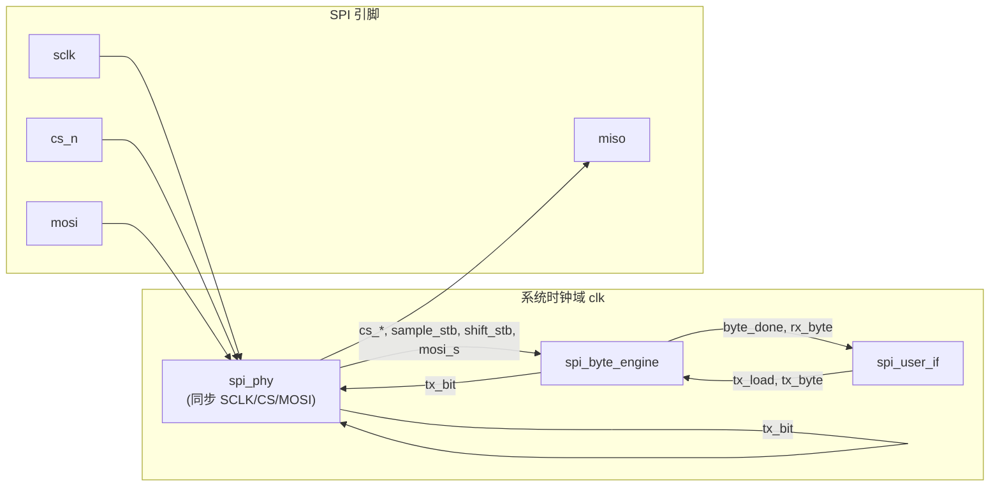

# SPI Slave IP

本文档描述本项目中 **FPGA SPI Slave** 的定位、架构与 Phase 1 实现规格。SPI 通用概念见 [SPI.md](../SPI.md)。

**实现状态（Phase 1）：** RTL 已按四层模块拆分落地；Icarus Verilog 仿真通过（T1–T5）。上板与 MCU 互通待完成。

---

## 1. 角色与目标

在本项目里，FPGA 作为 **Slave**，MCU 作为 **Master**：

```
MCU (Master)  ──SPI──→  FPGA (Slave)  ──→  内部逻辑 / FIFO / 测试数据源
              ←─SPI───
```

| 阶段 | Slave 要做什么 | 状态 |
|------|----------------|------|
| Phase 1 | 正确收发字节；Mode 0；CS 保持下连续多字节；仿真 + 上板与 MCU 互通 | RTL + 仿真 ✓；上板待测 |
| Phase 2 | 对接内部数据源（ADC / 逻辑），非 echo 业务路径 | 未开始 |
| 后续 | RX/TX FIFO、更高 SCLK、帧协议；为高速 SPI 留扩展点 | — |

Phase 1 的成功标准：**MCU 发任意字节序列，FPGA 能稳定接收；FPGA 回传的数据与预期一致（如 echo）**。

---

## 2. 架构

Slave 按四层拆分，避免把「引脚同步 / 边沿检测」「移位计数」和「字节握手」写在一起：

```
spi_slave_top                 顶层：引脚 + 参数 + 子模块例化
├── spi_phy                   PHY：引脚同步、CS 帧检测、sample/shift 选通、MISO 驱动
├── spi_byte_engine           字节引擎：移位寄存器、bit 计数、byte_done
└── spi_user_if               用户接口：RX valid、TX load / valid 握手
```



**时钟域说明：**

- 全部逻辑在 **系统时钟 `clk`** 域运行；`sclk`、`cs_n`、`mosi` 经 `spi_phy` 双 flop 同步后再做边沿检测。
- `sample_stb` / `shift_stb` 为 `clk` 域单周期脉冲，由 `CPOL/CPHA` 与 SCLK 边沿组合产生；`spi_byte_engine` 据此移位，与 SPI mode 解耦。
- `miso` 在 `spi_phy` 内组合驱动：`cs_active ? tx_bit : 1'b0`；`tx_load` 后首 bit 立即可见。
- 用户侧 `rx_valid`、`tx_valid` 等同理在 `clk` 域；`byte_done` 无需跨域同步。

---

## 3. Phase 1 规格

### 3.1 固定与可参数

| 项目 | Phase 1 | 参数名 | 当前 RTL |
|------|---------|--------|----------|
| SPI Mode | **Mode 0**（CPOL=0, CPHA=0） | `CPOL`, `CPHA` | 已参数化；仿真仅验 Mode 0 |
| 数据位宽 | 8 bit | `DATA_WIDTH` | 默认 8 |
| 位序 | MSB first | `LSB_FIRST` | 默认 0（MSB first） |
| CS | 低有效；CS↑ 结束帧，未完成 bit 丢弃并复位计数 | — | ✓ |
| 多字节 | **CS 保持低**：连续传多个字节，字节间无需 toggle CS | — | ✓ |

### 3.2 Mode 0 时序（Phase 1 必须满足）

- **CPOL=0**：空闲时 SCLK 为低。
- **CPHA=0**：CS 有效后，第一个 SCLK **上升沿**采样 MOSI（`sample_stb`）；MISO 在 **下降沿**移位更新（`shift_stb`），上升沿前稳定。

```
CS_N  ‾‾‾\__________________________/‾‾‾
SCLK  ‾‾‾\_/‾\_/‾\_/‾\_/‾\_/‾\_/‾\_/‾‾‾
MOSI  ----< B7 >< B6 >< B5 >...< B0 >----
MISO  ----< B7 >< B6 >< B5 >...< B0 >----
      ↑ CS↓                              ↑ CS↑
      首字节 MSB 先传                    帧结束
```

### 3.3 行为摘要

1. **CS_N 下降沿（`cs_start`）**：bit 计数清零；若 `tx_ready`，加载首字节到 TX 移位寄存器。
2. **每个 `sample_stb`**：MOSI → RX 移位寄存器；计满 `DATA_WIDTH` 时锁存 `rx_byte` 并产生 `byte_done`。
3. **每个 `shift_stb`**：TX 移位寄存器移出下一位到 `tx_bit` → `miso`。
4. **`byte_done` 且 CS 仍有效**：向用户侧脉冲 `rx_valid`；若 `tx_ready` 则 `tx_load` 下一发送字节，否则置 `tx_valid` 请求数据。
5. **CS_N 上升沿（`cs_end`）**：复位 bit 计数与 RX 移位；清除 `tx_valid`；未完成 8 bit 的传输丢弃。

---

## 4. 模块接口

### 4.1 顶层 `spi_slave_top`

```verilog
module spi_slave_top #(
    parameter CPOL       = 1'b0,
    parameter CPHA       = 1'b0,
    parameter DATA_WIDTH = 8,
    parameter LSB_FIRST  = 1'b0
) (
    input  wire                     clk,
    input  wire                     rst_n,

    input  wire                     sclk,
    input  wire                     cs_n,
    input  wire                     mosi,
    output wire                     miso,

    output wire                     rx_valid,
    output wire [DATA_WIDTH-1:0]    rx_data,
    input  wire                     tx_ready,
    input  wire [DATA_WIDTH-1:0]    tx_data,
    output wire                     tx_valid
);
```

### 4.2 内部互联（子模块间）

| 信号 | 来源 → 去向 | 说明 |
|------|-------------|------|
| `cs_active` | phy → byte, if | CS 同步后低有效 |
| `cs_start` | phy → byte, if | CS 下降沿单周期脉冲 |
| `cs_end` | phy → byte, if | CS 上升沿单周期脉冲 |
| `sample_stb` | phy → byte | 采样 MOSI 的 clk 域脉冲 |
| `shift_stb` | phy → byte | 移位 TX 的 clk 域脉冲 |
| `mosi_s` | phy → byte | 同步后的 MOSI |
| `tx_bit` | byte → phy | 当前待输出的 MISO 位 |
| `tx_load` | if → byte | 加载 `tx_byte` 到 TX 移位寄存器 |
| `tx_byte` | if → byte | 待发送字节 |
| `rx_byte` | byte → if | 刚完成的 RX 字节 |
| `byte_done` | byte → if | 一字节接收完成脉冲 |

### 4.3 握手语义

`rx_*` / `tx_*` 是 **面向 FPGA 系统内部** 的接口，不是板级引脚。Slave 与 Master 各自有一套同构的用户口；与 Gestalt SPI IP 库中其他模块（FIFO、寄存器、数据源）对接，而不是直接连到 MCU。

| 信号 | 方向 | 说明 |
|------|------|------|
| `rx_valid` | 出 | 每完成一字节置 1 一个 `clk` 周期；`rx_data` 有效 |
| `tx_valid` | 出 | 需要下一发送字节但 `tx_ready` 为 0 时置 1；`cs_end` 清零 |
| `tx_ready` | 入 | 内部逻辑有数据可发；与 `cs_start` 或 `byte_done` 同周期采样 `tx_data` |
| `tx_load` | 内部 | `tx_ready && (cs_start \|\| (byte_done && cs_active))` 时加载 `tx_data` → `tx_byte` |

加载时机：

- **帧开始（`cs_start`）**：预装首字节，使第一个 SCLK 前 MISO 已有 MSB。
- **帧内（`byte_done && cs_active`）**：每收完一字节，若 `tx_ready` 则立即装下一字节；否则保持 `tx_valid` 直到用户提供数据。

完整 SPI IP 库的边界划分：

```
外部世界                    FPGA 芯片内部
─────────                  ──────────────────────────────────
MCU / 外设  ←SPI 引脚→  [ spi_slave | spi_master ]  ←用户口→  FIFO / 逻辑
```

Phase 1 echo 参考连接：`tx_data = rx_data`（或延迟一拍寄存），`tx_ready = 1`，用于最快打通链路。Testbench 在 `cs_start` 前更新 `echo_data` 并等待一个 `clk` 再拉低 CS。

### 4.4 `spi_phy`

- 对 `sclk`、`cs_n`、`mosi` 做双 flop 同步。
- 检测 `cs_start` / `cs_end`；输出 `cs_active`。
- 由 `CPOL/CPHA` 从 SCLK 上升/下降沿产生 `sample_stb`、`shift_stb`（Mode 0–3 通用表，Phase 1 仅验 Mode 0）。
- 组合驱动 `miso = cs_active ? tx_bit : 1'b0`。

### 4.5 `spi_byte_engine`

- 在 `sample_stb` 时移位 RX、递增 bit 计数；计满产生 `byte_done` 并锁存 `rx_byte`。
- 在 `shift_stb` 时移位 TX；`tx_load` 时将 `tx_byte` 装入 TX 移位寄存器。
- `cs_start` 清零 bit 计数；`cs_end` 复位 RX 移位与计数。
- `tx_bit` 取 MSB（或 LSB，由 `LSB_FIRST` 定）。

### 4.6 `spi_user_if`

- `rx_valid <= byte_done`；`byte_done` 时锁存 `rx_data <= rx_byte`。
- 管理 `tx_load` / `tx_byte` / `tx_valid` 握手（见 4.3）。

---

## 5. 目录与工程

当前 Gowin 工程与源码布局：

```
spi_slave/
├── spi_slave.md              ← 本文档
└── spi_slave_p1/
    ├── spi_slave_p1.gprj     ← GW2A-18C，含 src 下四份 RTL
    ├── src/
    │   ├── spi_slave_top.v
    │   ├── spi_phy.v
    │   ├── spi_byte_engine.v
    │   └── spi_user_if.v
    ├── tb/
    │   └── tb_spi_slave.v    ← Master BFM + 自检
    └── impl/                   ← Gowin 实现配置（上板）
```

`spi_slave_p1.gprj` 已指向上述四个源文件，无单文件 `SPI_Slave.v` 遗留项。

---

## 6. 验证

### 6.1 仿真

```bash
cd spi_slave/spi_slave_p1
iverilog -o sim.vvp -g2012 \
  src/spi_phy.v src/spi_byte_engine.v src/spi_user_if.v src/spi_slave_top.v \
  tb/tb_spi_slave.v
vvp sim.vvp
# 期望末尾：[PASS] tb_spi_slave
```

| 用例 | 内容 | 通过条件 | tb 覆盖 |
|------|------|----------|---------|
| T1 | 单字节 `0x55` echo | MISO 回读与发送一致 | ✓ |
| T2 | 单字节 `0xAA` echo | 同上 | ✓ |
| T3 | CS 保持，连续 4 字节 `0x01`–`0x04` | `rx_data` 顺序、数值全对 | ✓ |
| T4 | CS 中途拉高（半字节后 abort） | 无错误 `rx_valid`；下次 CS↓ 重新同步 | ✓（abort 帧无 rx 检查） |
| T5 | CS toggle 后新帧单字节 `0x12` | 正确接收 | ✓ |

Testbench 内建 **SPI Master BFM**：产生 SCLK、驱动 MOSI、采样 MISO；DUT 侧 echo 通过 `tx_data = echo_data`、`tx_ready = 1` 实现。

### 6.2 上板（Gowin GW2A-18C + 片上 MCU）

1. MCU SPI Master，Mode 0，初始 1 MHz。
2. FPGA echo 或固定计数回读。
3. MCU 经 UART 打印收发的 hex，与发送比对。
4. 逐步提高 SCLK，记录最高稳定频率。

### 6.3 波形必看信号

```
cs_n, sclk, mosi, miso
sample_stb, shift_stb, byte_done（clk 域）
rx_valid, rx_data, tx_valid, tx_load（系统域）
```

---

## 7. 后续扩展（不在 Phase 1 实现）

| 扩展 | 说明 |
|------|------|
| Mode 1–3 回归 | RTL 已参数化 CPOL/CPHA；需补充 directed test |
| RX/TX FIFO | 解耦 SPI 速率与内部处理；应对 burst / ADC 吞吐 |
| 寄存器 map | 命令字、状态、长度、DMA 式读 FIFO |
| 帧协议 | 帧头 + length + payload + CRC，放在 MAC 层 |
| 高速 / QSPI | 更高 SCLK、4 线并行；PHY 层替换，用户 FIFO 接口可保留 |

---

## 8. 相关文档

- [SPI.md](../SPI.md) — SPI 概念与选型
- [Readme.md](../Readme.md) — 项目阶段与系统架构
